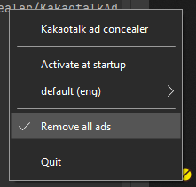

# KakaotalkAdConcealer

- [English](./README.md)
- [한국어](./README.kr.md)

## 소개

KakaotalkAdConcealer는 PC버전 카카오톡의 내장광고와 팝업을 없애줍니다 (정확히는 숨겨줍니다).

## 고지

**!!! 실험적인 프로젝트입니다 !!!**

이 프로젝트는 유명한 프로젝트인 [blurfx/KakaoTalkAdBlock](https://github.com/blurfx/KakaoTalkAdBlock) 의 떨어지는 코드 가독성을 개선하고, 전반적인 구조 개선을 위해 만들어졌습니다.

코드 가독성을 위해 리팩터링을 진행하여, 기존의 P/Invoke방식 WIn32 api호출을 모두 C++/CLI 계층을 이용하도록 재구성되었습니다.

즉, 이것은 최종 사용자에겐 그다지 좋은 선택이 아닐지도 모릅니다.

실제로, 이것은 기존의 [릴리즈(1.2.0a)](https://github.com/blurfx/KakaoTalkAdBlock/releases/tag/1.2.0-alpha) 보다 조금 더 많은 메모리를 소모하는 경향이 있습니다.

## 환경

- 타겟 OS  :  Windows10
- .Net 버전  :  .Net 6.0.0

## 요구 사항

- [.Net 6.0.0 런타임](https://dotnet.microsoft.com/download/dotnet/6.0)

## 라이선스

[MIT 라이선스](./LICENSE).

세부사항은 [이곳](./LICENSE)을 참조해주세요.

## Preview

- 전 / 후

- 트레이에서 작동

- 시작 알림

