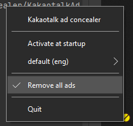

# KakaotalkAdConcealer

- [English](./README.md)
- [한국어](./README.kr.md)

## Introduce

This removes ads from Kakaotalk pc client (hides them invisible to users).

You'll be able to stop watching boring commercials.

## Notice

**!!! This is an experimental project !!!**

This is an experimental work made to change the overall structure and improve the code readability of [blurfx/KakaoTalkAdBlock](https://github.com/blurfx/KakaoTalkAdBlock).

Refactored for code readability, changing existing P/Invoke-style Win32 API calls to use the C+/CLI layer.

That said, this may not be a good choice for end users.

In practice, this also tends to consume slightly more memory than [this release(1.2.0a)](https://github.com/blurfx/KakaoTalkAdBlock/releases/tag/1.2.0-alpha).

## Environment

- Target OS  :  Windows10
- .Net version  :  .Net 6.0.0

## Requirement

- [.Net 6.0.0 Runtime](https://dotnet.microsoft.com/download/dotnet/6.0)

## License

Only [MIT License](./LICENSE).

Details are in the [file](./LICENSE).

## Preview

- Before / After

- Run in tray

- Startup notification

